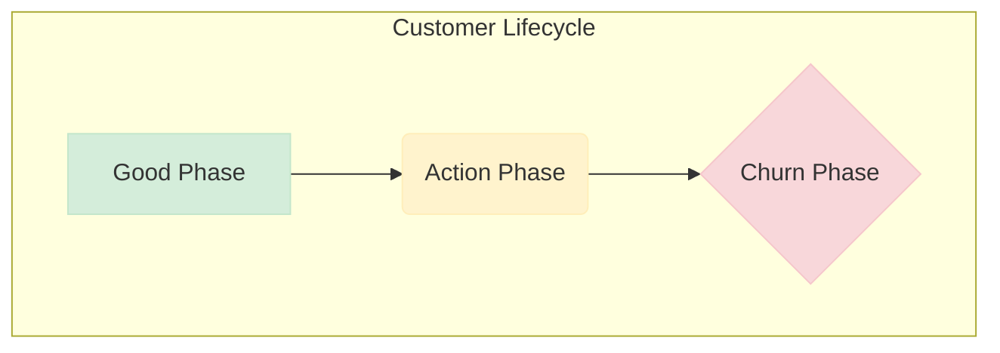

# Customer Churn Prediction 📉

## Business Problem Overview 🎯

In the highly competitive telecom industry, providers face an average annual churn rate of 15-25%. Acquiring a new customer costs 5-10 times more than retaining an existing one, making **customer retention** a top priority. For many operators, retaining high-profitability customers is the number one business goal.

This project aims to help a leading telecom firm reduce customer churn by building a predictive model to identify customers at high risk of leaving. The model will also identify the main indicators of churn, allowing the company to take proactive steps to retain valuable customers.

## Understanding and Defining Churn 🤔

### Postpaid vs. Prepaid Models

* **Postpaid**: Customers are billed after using services. Churn is explicit, as users must terminate their contracts.
* **Prepaid**: Customers pay in advance. Churn is harder to define, as users can simply stop using the service without notice. This is the more common model in the Indian and Southeast Asian markets, which are the focus of this project.

### Definitions of Churn
Churn can be defined in several ways:
* **Revenue-based churn**: Customers who don't generate revenue over a given period.
* **Usage-based churn**: Customers who have no incoming or outgoing usage (calls, internet, etc.).

This project will use the **usage-based definition** to identify churners.

## Project Goals 🚀

The primary objectives of this project are:
1.  **Predict Churn**: Build a model to predict whether a high-value customer will churn in the near future.
2.  **Identify Churn Indicators**: Use a separate, interpretable model to identify the key variables that are strong predictors of churn.
3.  **Recommend Retention Strategies**: Suggest actionable strategies to manage and reduce customer churn based on the model's findings.

### High-Value Churn

Since approximately 80% of revenue comes from the top 20% of customers, this project will focus exclusively on predicting churn for **high-value customers**.

## Customer Behavior During Churn 🚶‍♂️

Customer churn is typically a gradual process with three distinct phases:

1.  **The 'Good' Phase**: The customer is satisfied with the service and exhibits normal usage patterns.
2.  **The 'Action' Phase**: The customer's experience declines due to competitor offers, service quality issues, or billing problems. Their behavior may change, signaling a high risk of churn. This is the crucial phase for intervention.
3.  **The 'Churn' Phase**: The customer stops using the service and is officially considered churned.

---

## Data Dictionary
The dataset can be download using this link. The data dictionary is provided in the Data_Dictionary folder.

The data dictionary contains meanings of abbreviations. Some frequent ones are loc (local), IC (incoming), OG (outgoing), T2T (telecom operator to telecom operator), T2O (telecom operator to another operator), RECH (recharge) etc.

The attributes containing 6, 7, 8, 9 as suffixes imply that those correspond to the months 6, 7, 8, 9 respectively.

## Data Preparation
The following data preparation steps are crucial for this problem:

1. Derive new features

This is one of the most important parts of data preparation since good features are often the differentiators between good and bad models. Use your business understanding to derive features you think could be important indicators of churn.

2. Filter high-value customers

As mentioned above, you need to predict churn only for the high-value customers. Define high-value customers as follows: Those who have recharged with an amount more than or equal to X, where X is the 70th percentile of the average recharge amount in the first two months (the good phase).

After filtering the high-value customers, you should get about 29.9k rows.

3. Tag churners and remove attributes of the churn phase

Now tag the churned customers (churn=1, else 0) based on the fourth month as follows: Those who have not made any calls (either incoming or outgoing) AND have not used mobile internet even once in the churn phase. The attributes you need to use to tag churners are:

total_ic_mou_9

total_og_mou_9

vol_2g_mb_9

vol_3g_mb_9

After tagging churners, remove all the attributes corresponding to the churn phase (all attributes having ‘ _9’, etc. in their names).

## Modelling
Build models to predict churn. The predictive model that you’re going to build will serve two purposes:

It will be used to predict whether a high-value customer will churn or not, in near future (i.e. churn phase). By knowing this, the company can take action steps such as providing special plans, discounts on recharge etc.

It will be used to identify important variables that are strong predictors of churn. These variables may also indicate why customers choose to switch to other networks.

In some cases, both of the above-stated goals can be achieved by a single machine learning model. But here, you have a large number of attributes, and thus you should try using a dimensionality reduction technique such as PCA and then build a predictive model. After PCA, you can use any classification model.

Also, since the rate of churn is typically low (about 5-10%, this is called class-imbalance) - try using techniques to handle class imbalance. 

You can take the following suggestive steps to build the model:

Preprocess data (convert columns to appropriate formats, handle missing values, etc.)

Conduct appropriate exploratory analysis to extract useful insights (whether directly useful for business or for eventual modelling/feature engineering).

Derive new features.

Reduce the number of variables using PCA.

Train a variety of models, tune model hyperparameters, etc. (handle class imbalance using appropriate techniques).

Evaluate the models using appropriate evaluation metrics. Note that is is more important to identify churners than the non-churners accurately - choose an appropriate evaluation metric which reflects this business goal.

Finally, choose a model based on some evaluation metric.

The above model will only be able to achieve one of the two goals - to predict customers who will churn. You can’t use the above model to identify the important features for churn. That’s because PCA usually creates components which are not easy to interpret.

Therefore, build another model with the main objective of identifying important predictor attributes which help the business understand indicators of churn. A good choice to identify important variables is a logistic regression model or a model from the tree family. In case of logistic regression, make sure to handle multi-collinearity.

After identifying important predictors, display them visually - you can use plots, summary tables etc. - whatever you think best conveys the importance of features.

Finally, recommend strategies to manage customer churn based on your observations.

