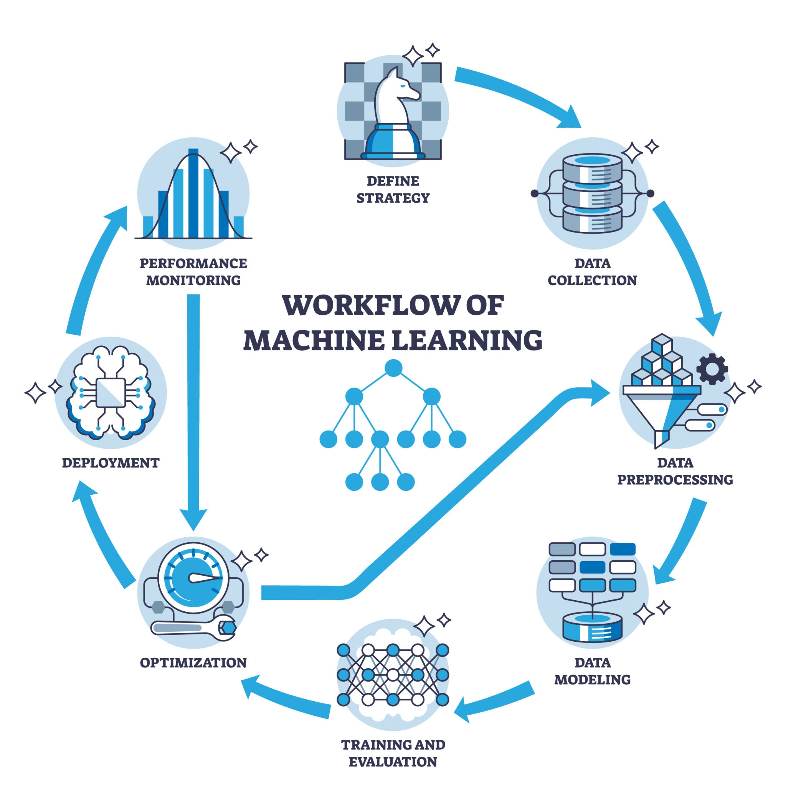

# Customer Churn Prediction 📉
<p align="center">
	

## 📌 Project Overview

This project is based on a step-by-step tutorial that demonstrates how to build machine learning classification models to predict **customer churn** using the **Telco Customer Dataset**.  

The tutorial is beginner-friendly and walks through the full ML pipeline:

- Data Loading  
- Data Preprocessing  
- Exploratory Data Analysis (EDA)  
- Feature Engineering  
- Model Training  
- Model Evaluation  
- Suggestions for Improvements  

---

## 🎯 What is Customer Churn?

Customer churn refers to customers stopping doing business with a company.

Predicting churn helps businesses:

- Retain customers  
- Reduce revenue losses  
- Target at-risk customers with retention strategies  

---

## 📂 Dataset Overview

- **Dataset Name**: Telco Customer Churn Dataset  
- **Rows**: 7043  
- **Columns**: 21  
- **Target Variable**: `churn` (Yes/No)

### Feature Types

- **Numerical Features**
  - Tenure (int)
  - Monthly Charges (float)
  - Total Charges (converted from object → float)

- **Categorical Features**
  - Gender
  - Partner
  - Phone Service
  - Contract Type
  - Payment Method
  - Many more...

---

## ⚙️ Workflow Pipeline

```mermaid
flowchart TD
    A[Load Dataset] --> B[Data Cleaning]
    B --> C[Exploratory Data Analysis]
    C --> D[Feature Engineering]
    D --> E[Train-Test Split]
    E --> F[Model Training]
    F --> G[Model Evaluation]
    G --> H[Model Improvement Suggestions]
